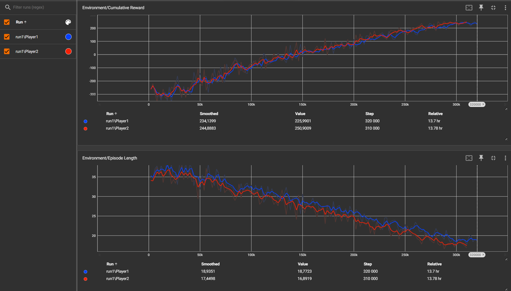

<p align="center"></p>

## ⚡️ O que é o Cosmic Confrontation?

Um jogo de aventura 3D que passa-se em uma ilha com vários cenários num planeta distante, onde o jogador iniciará o jogo com Halley Bennet, que parte em uma aventura para encontrar um tesouro escondido antes que os piratas do universo cheguem primeiro, dessa forma para devolver a vida à normalidade do cosmo pelos que foi conquistada pelos piratas.

Cosmic Confrontation é um jogo desenvolvido em ambiente desktop com Unity.

> Esta não é um jogo oficializado no mercado, foi construida no âmbito académico de forma aumentar as nossas capacidades técnicas e interpessoais.

## 💡 Pré-Requisitos

Para comerçar a usar o software localmente na sua máquina, basta instalar o [Unity](https://unity.com/pt/download). Foi utilizada a versão ```2022.3.10f1```, caso queira a versão exata pode encontrá-la [aqui](https://unity.com/pt/releases/editor/archive).

## ⚙️ Instalação

Para colocar o projeto a funcionar localmente na sua máquina basta:

1. Clonar o repositório.

2. Abrir o Unity Hub.

3. Instalar a versão do Unity.

4. Abrir o projeto no Unity.

## 🤖 1º Técnica de IA - Path Finding para movimento das aranhas

###  Navmesh: 

O objetivo pretendido seria que as aranhas se deslocassem pelo mapa em diferentes direções, com uma velocidade e distância constante. Para isso foi utilizada a solução de pathfinding do unity chamada de Navmesh, que foi adicionada à superfície e foi realizado bake da mesma, o que permitiu criar assim uma mesh de navegação com a área pela qual a aranha pode andar.  De forma a permitir que a aranha circule pela cena utilizando a Navmesh foi necessário adicionar um componente à mesma, chamado de Navmesh Agent. 

###  Implementação:

A nível de código foram utilizadas três funções, sendo elas o Start, Update e SetRandomTarget.

Quando inicia a cena é chamada a função SetRandomTarget() para o movimento das aranhas, que faz a verificação através de um if else. Se a aranha está a andar para a frente, a posição target é definida como a posição inicial da aranha mais um ponto aleatório da esfera multiplicado pela distância máxima definida. Se não estiver a mover para a frente, a posição target é definida como sendo igual à inicial.

Na função Update que vai sendo atualizada a cada frame, é feita a verificação através de um if, se a distância restante para a posição alvo é inferior a 0.1 e se for chama a função SetRandomTarget para calcular um novo ponto de destino. Desta forma a aranha irá sempre andar em diferentes direções. 

#### Ficheiros utilizados

O código relativo ao **desenvolvimento da técnica** encontra-se em [Assets/Scripts/SpiderAI.cs](Assets/Scripts/SpiderAI.cs).

### Demonstração

Criamos uma pequeno **trailer** para mostrar o funcionamento do pathfinding das aranhas.
[](https://www.youtube.com/watch?v=0DWwADyst5Y)

## 🤖 2º Técnica de IA - Máquina de Estados para tomada de decisão dos inimigos

Para este tópico, foi criada uma máquina de estados, que faz a transição entre 5 estados:
Idle, patrulhar, atacar parado, atacar a caminhar e morrer. Para cada um destes estados foram criadas uma classe para cada estado.
Estas classes foram criadas a partir da baseState, que é a classe da qual herdam os métodos principais da máquina de estados: Enter, Update e Exit.
Também foi criado uma classe cahamda stateManager, que vai gerir a transição entre estados. Esta classe é a super classe da EnemyStateMachine, na qual vai injectar as features do enemy nos diferentes estados.
A execução deste código acontece na classe EnemyScript.

Além disso, também é executado um script chamado EnemyGroupScript que permite mudar estado para diferentes enemies ao mesmo tempo.

Scripts utilizados/criados:
- BaseState
- EnemyStateMachine
- StateManager
- AttackChaseEnemy
- AttackIdleEnemy
- DeathEnemy
- IdleEnemy
- PatrolEnemy
- EnemyGroupScript

O código encontra-se na branch [ai-state-machine](https://github.com/luispereira1999/cosmic-confrontation/tree/ai-state-machine)


---


## 🤖 3º Técnica de IA - Aprendizado por Reforço para resolver um puzzle

### Enquadramento

No decorrer do jogo produzido na unidade curricular de Projeto Aplicado, decidimos fazer uma adaptação para uso da técnica de inteligência artificial de aprendizado por reforço na unidade curricular de Inteligência Artificial Aplicada a Jogos.\
Escolhemos esta técnica, pelo facto de já termos um puzzle no nosso jogo e, a ideia que o jogador treinado com IA através de tentativa-erro para **resolver um puzzle** e aprender consoante o ambiente que está exposto, enquadra-se bem na sua aplicação.\
Instalou-se o [Python 3.9.13](https://www.python.org/downloads/release/python-3913) para criar um ambiente, e usufruiu-se principalmente da biblioteca [ML-Agents](https://github.com/Unity-Technologies/ml-agents) que permitiu realizar o treinamento e o desenvolvimento dos agentes inteligentes no [Unity](https://unity.com/pt).

### Demonstração

Criamos uma pequeno **trailer** para mostrar o funcionamento da técnica de aprendizado por reforço.
[](https://youtu.be/1awGiTleCNA)

No **treino** obtivemos os resultados abaixo:\
O gráfico "Cumulative Reward" refere-se à soma acumulada das recompensas pelos agentes ao longo do tempo, se a curva subir corresponde ao objetivo central, maximizar a recompensa. O gráfico "Episode Length" indica a duração das ações que os agentes tomam em um episódio, se a linha decrescer significa que ao longo do tempo aprende as tarefas mais eficiente.\
Através destas 2 métricas concluímos que o modelo treinado apresenta bons resultados.



### Implementação

Primeiro de tudo, recorremos aos conteúdos disponibilizadas pelo docente e às informações contidas na internet para abordar a teoria por trás do aprendizado por reforço.\
Foram utilizados 2 agentes que tomam decisões, um para escolher a 1º peça e outro para escolher a 2º peça, e no fim as peças trocam de lugar no puzzle.
Durante o treinamento usou-se um número máximo de 30 tentativas, cada uma envolvendo a troca de 2 peças, se não resolvesse o puzzle nessas tentativas, perdia e recomeçava de novo, para assim acrescentar mais um indicador para melhor ser o treino.

#### Ficheiros utilizados

O código relativo ao **desenvolvimento da técnica** encontra-se em [Assets/SolvePuzzleAI/Scripts](Assets/SolvePuzzleAI/Scripts).\
As **cenas** de jogo para visualizar os resultados (uma para treinar outra com os modelos já treinados) encontra-se em [Assets/SolvePuzzleAI/Scenes](Assets/SolvePuzzleAI/Scenes).\
Os **modelos treinados** para cada agente encontra-se em [Assets/SolvePuzzleAI/ModelsAI](Assets/SolvePuzzleAI/ModelsAI).\
O **ficheiro de configuração** para executar o treinamento encontra-se em [Config/trainconfig.yaml](Config/trainconfig.yaml).\
A pasta dos **resultados do treinamento** encontra-se em [Assets/SolvePuzzleAI/TrainingResults](Assets/SolvePuzzleAI/TrainingResults).

#### Observações

As observações são fundamentais ao fornecerem informações sobre o estado do ambiente aos agentes do aprendizado. Funcionam como sensores para que os agentes tomem decisões e interajam com o ambiente. Na capacidade dos agentes aprenderem utilizamos as seguintes observações:

- Posição atual das peças no mundo/no puzzle (posição no eixo x,y,z/números entre 1 a 9);
- Agente atual (usamos 2 agentes: 1 para escolher a 1º peça e o outro para a 2º peça);
- Última peça escolhida (número escolhido).

#### Recompensas

As recompensas são o feedback sobre o desempenho das ações executadas pelos agentes. O objetivo é motivar o agente a aprender comportamentos que levem a resultados positivos e sofrer penalidades em ações que não o levam ao resultado pretendido, neste caso solucionar o puzzle.

- Troca correta das peças: +10
- Troca errada das peças: -10
- 1º peça escolhida diferente da 2º peça escolhida: +2
- 1º peça escolhida igual à 2º peça escolhida: -2
- Puzzle resolvido: +50
- Puzzle não resolvido (se as tentativas acabaram): -50

#### Configuração de ambiente de treino

Abrir a linha de comandos e executar os seguintes comandos: ir para a pasta raiz do projeto:

```sh
cd <caminho_pasta_raiz_do_projeto>         # vá para a pasta raiz do projeto
python -m venv <nome_do_ambiente>          # cria um novo ambiente
<nome_do_ambiente>\Scripts\activate        # Abre o ambiente criado
python -m pip install --upgrade pip        # instala os pacotes necessários:
pip3 install mlagents
pip3 install torch torchvision torchaudio
pip install protobuf==3.20.3
pip install onnx
pip install packaging
mlagents-learn Config\trainconfig.yaml --run-id=<nome_do_treino>    # inicia o treinamento
tensorboard --logdir results                                        # exibe resultados em gráficos
```

Depois do treino acabar, os ficheiros serão armazenados numa pasta chamada `results` na raiz do projeto!

## 👍 Contribuições

As contribuições são o que tornam a comunidade de código aberto um lugar incrível para aprender, inspirar e criar. Quaisquer contribuições que você faça são muito apreciadas.

Se você tiver uma sugestão de melhoria, por favor, faça fork do repositório e crie uma pull request. Ou pode simplesmente abrir um issue. Não se esqueça de dar uma estrela ao projeto! Obrigado mais uma vez!

## ⭐️ Colaboradores

- Luís Pereira
- Pedro Silva
- Vânia Pereira

## ⚠️ Licença

Ao contribuir para este projeto, você concorda com as políticas da licença [MIT](LICENSE).
